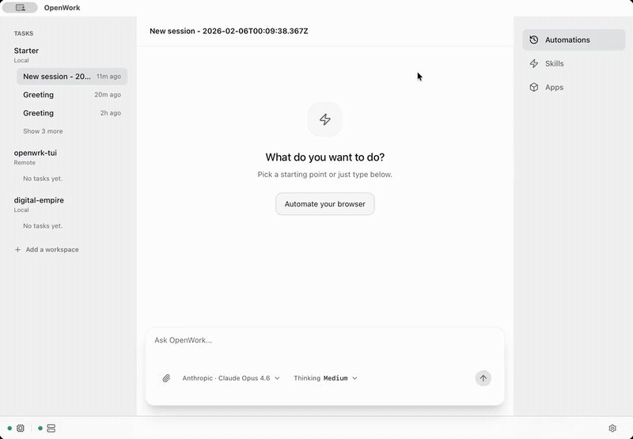

# OpenWork Plus

**OpenWork Plus** is an open-source enhanced distribution of [OpenWork](https://github.com/different-ai/openwork) — the local-first desktop experience for [OpenCode](https://opencode.ai).

Use Plus when you need **industry bundles**, **GUI/RPA automation**, **test automation**, **knowledge management**, and **super-automation** building blocks on top of the standard OpenWork runtime.

> **Not upstream OpenWork.** Plus is a separate project with its own releases and install identity. See [UPSTREAM.md](./UPSTREAM.md) for the relationship, sync strategy, and feature comparison.

**Website (planned):** [openwork.plus](https://openwork.plus)  
**Releases:** [github.com/comoxone/openwork-plus/releases](https://github.com/comoxone/openwork-plus/releases)

<p align="center">
  
</p>

## Why Plus exists

Upstream OpenWork is the best thin UI layer over OpenCode. Plus extends it for teams that want **productized vertical workflows** without giving up local-first control:

- **Industry Bundles** — install test-automation, knowledge-mgmt, computer-use, and custom bundles from Settings › Bundles or a Bundle Hub catalog
- **GUI / RPA** — `gui-operate-mcp` and native desktop automation providers
- **Test automation** — failure analysis skills, test-db MCP, dashboard UI, CI triggers
- **Knowledge wiki** — LLM-assisted wiki under `.openwork/knowledge/`
- **Task scheduler** — local cron-style triggers via `@openwork-plus/task-scheduler`
- **Sandbox bootstrap** — WSL/Lima-style isolated execution paths (platform-dependent)

Plus keeps upstream principles: OpenCode primitives first, ejectable CLI paths, no lock-in.

## Plus vs OpenWork (upstream)

| Capability | [OpenWork upstream](https://github.com/different-ai/openwork) | OpenWork Plus |
|------------|:--:|:--:|
| Tauri desktop + OpenCode sessions | ✅ | ✅ |
| Skills / MCP / plugins | ✅ | ✅ |
| Remote worker connect (URL + token) | ✅ | ✅ |
| Industry bundle installer + Hub | — | ✅ |
| Settings › Bundles UI | — | ✅ |
| gui-operate / RPA host | — | ✅ |
| Test automation bundle + dashboard | — | ✅ |
| Knowledge-mgmt LLM wiki | — | ✅ |
| Task scheduler package | — | ✅ |
| Den / OpenWork Cloud (`ee/`) | ✅ (FSL) | **Not shipped** in open source |

## Quick start

### Download

Pre-built binaries will be published to [GitHub Releases](https://github.com/comoxone/openwork-plus/releases).  
Documentation and downloads will also live at [openwork.plus](https://openwork.plus).

Plus installs **side-by-side** with upstream OpenWork (`com.openwork.plus` vs `com.differentai.openwork`).

### Build from source

**Requirements**

- Node.js + `pnpm@10.27.0` (`corepack enable`)
- **Bun 1.3.9+**
- Rust + Tauri CLI (`cargo install tauri-cli`)
- OpenCode CLI on `PATH`: [opencode.ai](https://opencode.ai)

```bash
git clone https://github.com/comoxone/openwork-plus.git
cd openwork-plus
pnpm install
pnpm dev
```

`pnpm dev` sets `OPENWORK_DEV_MODE=1` and uses an isolated dev data directory.

**Sanity check**

```bash
bun --version
pnpm --filter @openwork-plus/desktop exec tauri --version
pnpm run test:convergence
```

### CLI host (no desktop UI)

Same as upstream — orchestrator ships in-tree:

```bash
pnpm --filter openwork-plus-orchestrator exec openwork start --workspace /path/to/workspace --approval auto
```

See [apps/orchestrator/README.md](./apps/orchestrator/README.md).

## Architecture (high level)

```
┌─────────────────────────────────────────────────────────┐
│  OpenWork Plus Desktop (Tauri + SolidJS)                │
│  apps/app · apps/desktop                                │
├─────────────────────────────────────────────────────────┤
│  Industry Bundles · PluginRegistry · Settings › Bundles │
│  bundles/ · packages/gui-operate-mcp · rpa-host · …     │
├─────────────────────────────────────────────────────────┤
│  openwork-plus-orchestrator · openwork-plus-server · opencode     │
│  apps/orchestrator · apps/server                      │
└─────────────────────────────────────────────────────────┘
                          │
                    OpenCode engine
```

Details: [ARCHITECTURE.md](./ARCHITECTURE.md), [docs/01-architecture-overview.md](./docs/01-architecture-overview.md).

## Useful commands

```bash
pnpm dev              # Desktop (Tauri)
pnpm dev:ui           # Web UI only
pnpm typecheck
pnpm test:convergence # Plus integration smoke suite
pnpm test:e2e
pnpm bundle-hub:dev   # Local Bundle Hub
pnpm build            # Production desktop build
```

## Documentation

| Doc | Topic |
|-----|-------|
| [UPSTREAM.md](./UPSTREAM.md) | Upstream relationship & sync |
| [docs/README.md](./docs/README.md) | Full doc index |
| [docs/09-industry-bundle.md](./docs/09-industry-bundle.md) | Bundle format |
| [docs/13-industry-bundle-productization.md](./docs/13-industry-bundle-productization.md) | Bundles UI |
| [docs/convergence-acceptance-status.md](./docs/convergence-acceptance-status.md) | Feature status |

## Domain: openwork.plus

The `openwork.plus` domain is reserved for the Plus project:

| Planned use | Purpose |
|-------------|---------|
| `https://openwork.plus` | Product landing, feature overview, download links |
| `https://openwork.plus/docs` | User docs (can mirror or redirect to GitHub `/docs`) |
| `https://hub.openwork.plus` | Public Bundle Hub catalog CDN (optional) |
| `https://releases.openwork.plus` | Release artifact mirror (optional, GitHub remains primary) |

GitHub remains the **source of truth** for code and issues until the site is live.

## Contributing

1. Read [AGENTS.md](./AGENTS.md), [UPSTREAM.md](./UPSTREAM.md), and [docs/RENAME-MANIFEST.md](./docs/RENAME-MANIFEST.md) if you touch branding or release paths.
2. `pnpm install` then `pnpm run test:convergence` for integration changes.
3. Use [.github/pull_request_template.md](./.github/pull_request_template.md).

## License

MIT — see [LICENSE](./LICENSE).

Third-party components retain their original licenses. Portions derived from Open Cowork GUI automation and other sources are documented in package READMEs.

**Excluded from this repository:** the former `ee/` tree (Fair Source / enterprise cloud). It is not part of the open-source release.

## Acknowledgments

- [OpenWork](https://github.com/different-ai/openwork) — upstream desktop and server foundation
- [OpenCode](https://opencode.ai) — agent engine
- Community contributors to bundles, MCP tools, and fusion design docs
